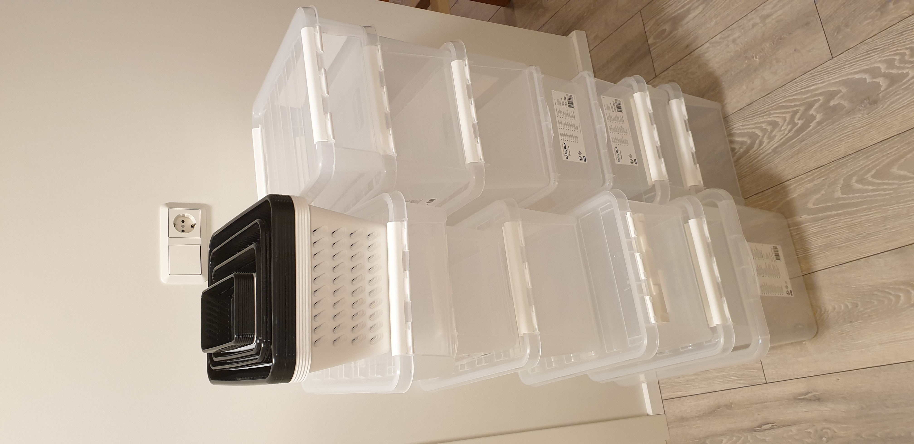
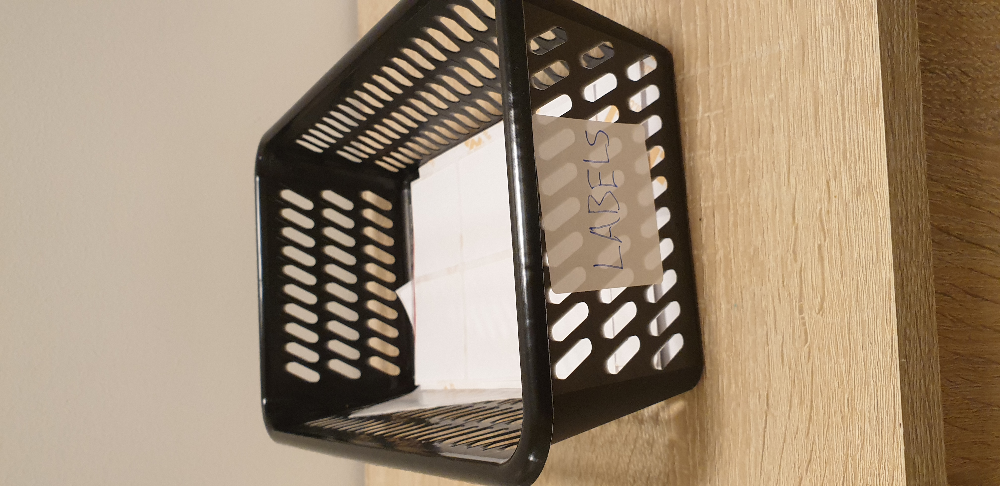
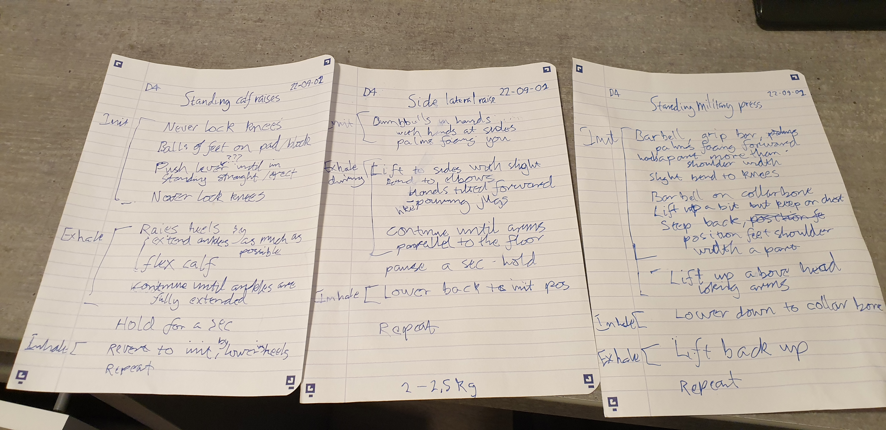

# Boxes and labels and questions and answers.

---

## Read on if you want to, or not. It's your choice now.

---

## Read as far as you want, stop when you want, it's your choice.

---

## Boxes

Picture of boxes:  

> I realized how much I like boxes so I went out and bought all the boxes I needed today. These boxes don't have labels but that's ok because there is nothing inside them yet. Once there's something inside I prefer my boxes to have labels because then I can be sure that when I'm focused on something else that needs doing but needs a thing from one of the boxes I can be sure I can find what I need when I need it rather than being confused which box I am looking for to find the thing I need because that is hard when I am focused on the thing I am actually doing. Sometimes when there's things in the boxes they might also have labels, sometimes different, sometimes same or sometimes only part of the label on the things inside the box is the same. I guess that's what defines the label on the box. I mean if I put folders of papers inside the boxes they might have labels but each folder might have different sections each with a label and the section might have a bunch of papers and each paper might have a label and each paragraph on the paper might have a label and each sentence in the paragraph might have a label and each word in the sentence might have a label and then I guess we are at the root of the issue, unless.....
> 
> Do the words also have sets of labels inside them? If so, does it continue? And then, how far?
> 
> I don't know but, I want to find out.

---
### Boxes comment #1
Will I need a big big box for these boxes later when I buy another set of boxes and how would I label it? How would I label the box for the new set of boxes? There's no end to the madness.

---
### Boxes comment #2
What happens if you put a thing with a label in a box with a different lable and all the other things in the box have the same label as the box?

Or what if all the things in all the boxes are the same but it's just the boxes that have different labels, not the things in them?

---
## Labels
Picture of labels:  

> I mean fuck it, why not?
>
> I like labels.

---
### Labels comment #1
Ngl. Took the labels out of the box for a sec and then I couldn't find the box for a bit so I couldn't label my labels during that time.

---
### Labels comment #2
Ok I'm probably going to end up needing at least two boxes for each type of label. One that always stays where it is and one that I can move. And for each type of label so I can find the type I need more easily. Although.. if I get used to the different types of labels I might be able to put them back in the same box as long as I'm sort of aware what's in the box, I think?

---

## Questions and answers
 
Picture of questions and answers:  

> Went to the gym today for the first time in a while and realized I could use my old notes on my gym routine to further develop my boxes and labels discussion. Don't have time to do that now. Posting now for timestamp.

---
### Learning

I went to the gym the day after I posted the boxes/labels pictures. I have different 5 days defined in my training routine. Each day has 3-4 different exercises. Initially I went to the gym with instructions from the internet on my phone and wrote the down the steps of each exercise on a sheet of paper. This was mostly to ensure my brain had processed all the info and the sheets would be easily readable for me.

Now I follow these steps confident that I will soon master this list, and once I do that I hope I can get back to using just the basic definitions.
*Anyway I guess this relates to the second labels comment.*

Originally I only made decent papers like this for day 3-5 and out of those only day 4 had clear definitions for all of the exercises and all of the steps. So naturally I took the papers for day 4 to the gym, path of least resistance.

I was gonna do all three but then I started the first, realized that even though it was easy to follow and the understanding came almost immediately (since I did a proper job of defining it originally) I didn't actually want to spend more time on practicing those because I had other matters to focus on, so I went home and appreciated that I could go slow with learning day 4 properly, maybe even over the course of a week or two while I put effort in defining the other days so that I can work on learning them when I get to that.

Taking it slow and learning at your own pace is nice.

---
### There is no such thing as a stupid question

Someone I trust who has been a part of my life since I was young recently told me about a very curious article about how 9 specialists working in a group, where everyone has already put so much effort into figuring stuff out, might actually function better as a team once one "idiot" is added to the mix. One that keeps asking questions. Simple questions, that demonstrate how how shallow their knowledge to appears be.
Apparently the article mentions that studies have shown (I won't cite that here, lows spoons) that adding an "idiot" like this improves the performance of specialist teams. It's because the “idiot” asks questions that are so simple none of the specialists would ever be confident in asking them. What if they were wrong about something or don't actually know things as completely as they thought, they might look bad in comparison to their peers if that came up. Or maybe they have just a bit different answers, both might be valid on their own but when cooperating it could reduce efficiency to not have proper mutual definitions of things as that creates potential for conflict. The point of the matter is that asking people who know a lot simple questions can sometimes bring up things that they missed, took for granted, or did wrong and that has the potential to improve everything, reducing conflict, improving efficiency, reducing loss and increasing success. Harmony all around. Plus it gives the world access to their specialist knowledge, which is a good thing.

---

If we use the gym plan pictures for context, the specialists could be doing the "standing calf raises" exercise. 

In the outlined definition of the standing calf raises the fourth step is "never lock knees". If we asked the specialists the question how to do th exercise we might find out 3 out of 9 are actually always locking the knees.

The first is doing it because they never really thought about that part.

The second is doing it because they were told to, but realize they now realize they were doing it wrong so they can fix that.

The third, realized they hadn't thought it through fully, but that they did what felt was right and but can't put it into words right now, but will keep on doing as they are doing. Who knows what answer they will give if they ever give one? Maybe they are different somehow and should be locking knee's and if thats it then that is ok. Or maybe it's something else, who knows. As long as it's only themselves they are putting at risk then it's their right to choose how they do it.

---

### **Bottom line.** 
Asking simple questions about things can be a really good thing for everyone. It sorts out the issues, furthers understanding and can make the ride smoother for everyone in the short term and in the long term. For me personally that is something I deeply care about.

**In fact it is the most important thing in life to me:**
*Working towards everyone being able to get as smooth a ride as possible through life.*

Offering people all the choices rather than letting their choice be dictated by society or others. (And that includes the choice of choosing).

But unfortunately some people are too afraid of the answers to let that happen.

*Ps. I think technology is maybe the most interesting area to focus on for creating choices, though I haven't thought it through all the way.*